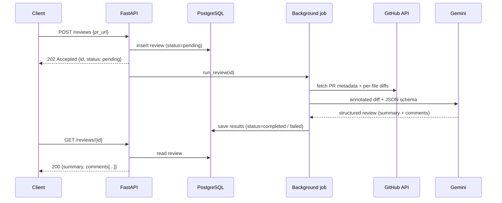

# AI-Powered PR Review Service

A backend service that fetches GitHub pull request diffs and generates structured,
line-level code-review feedback using an LLM. Reviews are processed asynchronously
and persisted in PostgreSQL.

**Stack:** Python · FastAPI · PostgreSQL · SQLAlchemy · Google Gemini API · Docker

## How it works



## Features

- **GitHub integration:** fetches PR metadata and per-file diffs, with pagination,
  noise filtering (lock files, images, minified files), and clear error mapping
  (not found, invalid token, rate limit)
- **Structured LLM output:** a Pydantic schema enforces `file`, `line`, `severity`,
  `category`, `message` and `suggestion` for every comment
- **Accurate line numbers:** diff hunks are annotated with new-file line numbers
  before being sent to the model
- **Resilience:** timeouts on all external calls; automatic fallback across models
  on retryable errors (429 / 5xx); non-retryable errors fail fast
- **Async processing:** `POST` returns `202 Accepted` immediately; clients poll
  `GET /reviews/{id}` until the review is `completed` or `failed`
- **Persistence:** reviews, comments (JSONB), status, error messages and the model
  used are stored in PostgreSQL

## API

| Method | Endpoint | Description |
|---|---|---|
| `POST` | `/reviews` | Submit a PR URL for review → `202` with `status: pending` |
| `GET` | `/reviews/{id}` | Retrieve a review (`pending` → `processing` → `completed` / `failed`) |
| `GET` | `/reviews` | List reviews. Filters: `repo_owner`, `repo_name`, `pr_number`, `status`. Pagination: `limit`, `offset` |
| `GET` | `/health` | Service and database health check |

**Request**

```json
POST /reviews
{ "pr_url": "https://github.com/SagaKale19/Pr-review-service/pull/1" }
```

**Example comment in a completed review**

```json
{
  "file": "sample/user_service.py",
  "line": 9,
  "severity": "critical",
  "category": "security",
  "message": "SQL injection vulnerability via string concatenation in SQL query.",
  "suggestion": "Use parameterized queries: cursor.execute('SELECT * FROM users WHERE username = ?', (username,))"
}
```

## Running locally

**Prerequisites:** Python 3.11+, Docker Desktop, a GitHub personal access token
(read-only) and a Google Gemini API key.

```bash
# 1. Start PostgreSQL (with pgvector) in Docker
docker compose up -d

# 2. Create a virtual environment and install dependencies
python -m venv .venv
.venv\Scripts\activate            # Windows  (macOS/Linux: source .venv/bin/activate)
pip install -r requirements.txt

# 3. Configure environment variables
cp .env.example .env              # then fill in GITHUB_TOKEN and GEMINI_API_KEY

# 4. Run the API
uvicorn app.main:app --reload
```

Open http://127.0.0.1:8000/docs for the interactive Swagger UI.

### Environment variables

| Variable | Description |
|---|---|
| `DATABASE_URL` | PostgreSQL connection string |
| `GITHUB_TOKEN` | GitHub personal access token (read-only) |
| `GEMINI_API_KEY` | Google Gemini API key |
| `GEMINI_MODEL` | Primary model used for reviews |
| `GEMINI_FALLBACK_MODELS` | Comma-separated models tried if the primary is unavailable |

### CLI helpers

```bash
# Run a review directly from the command line (no server needed)
python -m scripts.check_review https://github.com/<owner>/<repo>/pull/<number>

# Check which Gemini models are currently available
python -m scripts.ping_llm gemini-3.5-flash-lite gemini-3.8-flash
```

## Project structure

```
app/
├── main.py                 # FastAPI app, startup, health check
├── config.py               # settings loaded from environment variables
├── database.py             # SQLAlchemy engine and per-request session dependency
├── models.py               # Review table
├── schemas.py              # API request/response models
├── routers/
│   └── reviews.py          # REST endpoints
└── services/
    ├── github_client.py    # GitHub API integration
    ├── llm_reviewer.py     # prompt building and Gemini structured output
    └── review_service.py   # background review job
scripts/                    # CLI helpers
docker-compose.yml          # PostgreSQL + pgvector
```

## Design decisions

- **202 + polling instead of a blocking request:** LLM calls take several seconds and
  can fail, so the API responds immediately and the review runs in the background.
- **Per-file diffs:** the `/pulls/{n}/files` endpoint returns diffs split by file,
  which allows filtering irrelevant files and keeping prompts within a size budget.
- **Structured output over free text:** the LLM response is validated against a schema,
  so results can be stored as JSONB and returned by the API without fragile parsing.
- **Prompt-injection awareness:** the diff is treated as untrusted input; the system
  prompt instructs the model to ignore instructions embedded in code.
- **Least privilege:** the GitHub token only needs read access to pull requests.

## Limitations and next steps

- **Task queue:** FastAPI `BackgroundTasks` runs in-process; a production setup would use
  Celery or RQ with Redis for retries and durability across restarts
- **Migrations:** replace `create_all` with Alembic for versioned schema changes
- **RAG:** embed repository guidelines and related code with pgvector and pass retrieved
  context to the reviewer (the `context` parameter already exists in `LLMReviewer.review`)
- **GitHub webhooks:** trigger reviews automatically when a PR is opened and post
  comments back to the PR
- **Automated tests and evaluation:** pytest suite with mocked GitHub/LLM clients, plus a
  labelled set of PRs with known issues to measure review quality across models
